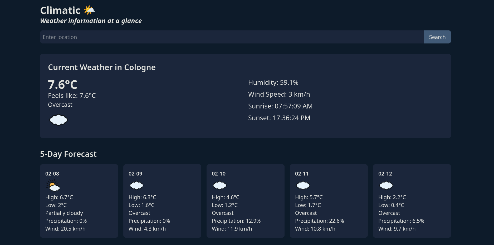

# 🌤️ Climatic

## Overview
A weather application that provides current weather conditions and daily forecasts for any city. Built with vanilla JavaScript, this project demonstrates the implementation of async/await for API calls and modular component architecture for a clean, maintainable codebase.

Live demo: [Climatic](https://julioapv.github.io/climatic/)

## 🚀 Project Highlights
- **Real-time Weather Data:** Fetches current weather conditions and forecasts using the VisualCrossing API.
- **Component-Based Architecture:** Organized into reusable components for better code organization.
- **Error Handling:** Error management with user-friendly error displays.
- **Clean User Interface:** Simple, responsive and intuitive interface for weather information.

## ✨ Key Features
1. **Current Weather Display:**
   - Shows temperature, feels-like temperature, and weather conditions
   - Displays humidity, wind speed, sunrise, and sunset times
   - Visual weather icons for quick understanding

2. **Daily Forecast:**
   - Multiple-day weather forecast
   - Shows high and low temperatures
   - Precipitation probability and wind speed
   - Weather condition icons for each day

3. **Search Functionality:**
   - Search for any city globally
   - Real-time data updates
   - Clear error handling for invalid searches

4. **Component Structure:**
   - Separate components for current weather and forecast
   - Modular design for easy maintenance
   - Clean separation of concerns

## 🎯 Learning Objectives
- Implement async/await for API calls
- Create modular components in vanilla JavaScript
- Handle API errors gracefully
- Practice DOM manipulation
- Work with weather data and date formatting

## 🕹️ How to Use It
1. Visit the live demo link: [https://julioapv.github.io/climatic/](https://julioapv.github.io/climatic/)
2. Enter a city name in the search bar
3. Click the search button or press enter
4. View the current weather and forecast information
5. Search for different cities as needed

## 🛠️ Technologies Used
- **HTML5:** For structuring the webpage.
- **CSS3:** For styling and responsive design.
- **JavaScript (ES6):** For interactivity and dynamic content rendering.
- **Tailwind CSS:** For utility-first styling and rapid development.

---
Happy Weather Checking! ☀️